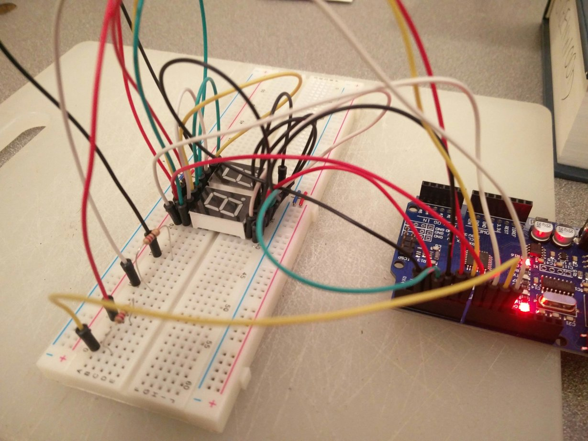

# 05 Multiplex

Drive more than one LED from a single arduino.  

## Comments

Q: Can an LED be strobed such that it's duty cycle (on time) is not 100%, so that
that the IO pins that control the LED segments be shared? Yes, this is common stuff.  

In this build, since my LEDs are common anode, I have two LEDs where the cathode
pins are tied to the same GPIO pin. Each LED common anode get's a separate GPIO 
pin. Only one common anode get's turned on (HIGH) at a time, thereby strobing
or timeslicing between the two leds. I strobed at about 1kHz.

* https://circuitdigest.com/microcontroller-projects/charlieplexing-arduino-to-control-12-leds-with-4-gpio-pins
* https://www.circuitbasics.com/arduino-7-segment-display-tutorial/

### TLDR

* c++ is hard
* cmake is hard
* arduinos seem to be finicky... sometimes the code deploys and runs,
sometimes old code runs, sometimes nothing runs... it's maddening
* I'm going to try rust next...perhaps on the STM32F3DISCOVERY

https://docs.rust-embedded.org/discovery/index.html

## Code

I broke the code out into separate files:

    $ tree -L 2
    .
    ├── CMakeLists.txt
    ├── eight_segment_led.ino
    └── src
        ├── charactermap.h
        ├── counter.h
        ├── debug.h
        ├── display.h
        ├── led.h
        ├── tests.h
        ├── timers.h
        └── writer.h

The root 'ino' file inits objects and wires code into the timers:

    /**
     * Configured at 2kHz
     */
    ISR(TIMER0_COMPA_vect) {
        led1.strobe();
        led2.strobe();
    }
    /**
     * Configured at 1Hz
     */
    ISR(TIMER1_COMPA_vect) {
        Serial.println("Version: 004");
        debug->flip();
        writer->trigger();
    }

I print a version number b/c I often cannot tell if my code loaded
successfully, or whether I'm running old code.

    Serial.println("Version: 004");

I added the 'src' directory to the project and moved code out of '.ino' and 
into separate '.h' files:

    # Define additional source and header files or default arduino sketch files
    set(${PROJECT_NAME}_SRCS src)
    set(${PROJECT_NAME}_HDRS src)

Here's what each file does:

* charactermap -> maps an int to a bool array that describes an 8 segment LED
* counter -> an upcounter for creating an incrementing display
* debug -> provides trace/debug/info/error messages, and an onboard LED flipper
* display -> aggregates multiple leds
* led -> maps the pins of an LED to the GPIO ports of an arduino
* tests -> rudimentary tests for the counter
* timers -> setup code for the timer0 and timer1
* writer -> writes output from the counter to the display 

## Build

## Notes
Here are my notes from my checkin on this:

    hello-world/05-multiplex
    
    * removed the Runnable class (too complicated)
    * extracted an upcounter class
    * added a debug class (trace/debug/info/error)
    * added an led flipper for board debugging
    * added basic tests
    
    This is where I go back to the basics and try to figure out
    how c++ really works, and how to do basic stuff with timers
    instead of the 'loop()' construct, as I need to increment
    the digits once / second (1Hz) but need to refresh the LED
    segments at something more like 1kHz.
    
    Successes:
    * using the timers is not hard
    * strobing the LEDs works as expected
    * added rudimentary tests, and they pass
    
    Failures:
    * the leds are lit, but the counter is not incrementing them
    * the entire toolchain, from clion to the plugin to the ttyUSB is
    like working with broken glass
    * the code sometimes runs, sometimes does not run
    * also unclear as to when the code actually updates on the device
    
    Thoughts:
    In order to get test code running locally, I'm going to have to
    really invest in understanding cmake and the entire c++
    ecosystem. I'd rather invest this time in learning rust and that
    realm, instead.

## Links

There are tons of resources that I looked at for this post, probably the most
useful are the timer notes:

* https://circuitdigest.com/microcontroller-projects/arduino-timer-tutorial
* https://sites.google.com/site/qeewiki/books/avr-guide/common-timer-theory
* https://sites.google.com/site/qeewiki/books/avr-guide/timers-on-the-atmega328

Watching the complexity explosion in CMake on the 'vector-of-bool' youtube
channel was enough to send me packing.

These other's were useful, too:

* https://hackaday.com/2017/05/05/using-modern-c-techniques-with-arduino/
* https://sites.google.com/site/qeewiki/datasheet-library
* https://sites.google.com/site/qeewiki/friends-tutorials/hexskews-atmega32l-bootloader
* https://wwThere must be a way to dw.arduino.cc/en/Main/Standalone
* https://www.arduino.cc/en/Guide/BoardAnatomy
* https://www.arduino.cc/en/Hacking/HomePage
* https://www.arduino.cc/en/Hacking/LibraryTutorial
* https://www.arduino.cc/en/Main/Standalone
* https://www.arduino.cc/en/Reference/EEPROM
* https://www.arduino.cc/en/Reference/FunctionDeclaration
* https://www.arduino.cc/en/Reference/PortManipulation
* https://www.arduino.cc/en/Tutorial/AnalogInputPins
* https://www.arduino.cc/en/Tutorial/DigitalPins
* https://www.arduino.cc/en/Tutorial/Foundations
* https://www.arduino.cc/en/Tutorial/Memory
* https://www.arduino.cc/en/Tutorial/PWM
* https://www.arduino.cc/en/Tutorial/Sketch
* https://www.arduino.cc/en/Tutorial/Variables
* https://www.arduino.cc/en/Tutorial/VidorHDL
* https://www.arduino.cc/reference/en/
* https://www.arduino.cc/reference/en/language/variables/utilities/progmem/
* https://www.instructables.com/id/Arduino-Timer-Interrupts/
* https://www.instructables.com/id/LED-Multiplexing-101-6-and-16-RGB-LEDs-With-Just-a/
* http://www.righto.com/2009/07/secrets-of-arduino-pwm.html

## End

* [Prev](../04a-code-structure/readme.md)
* [Next](../06-blinky-led-rust-arduino/readme.md)
