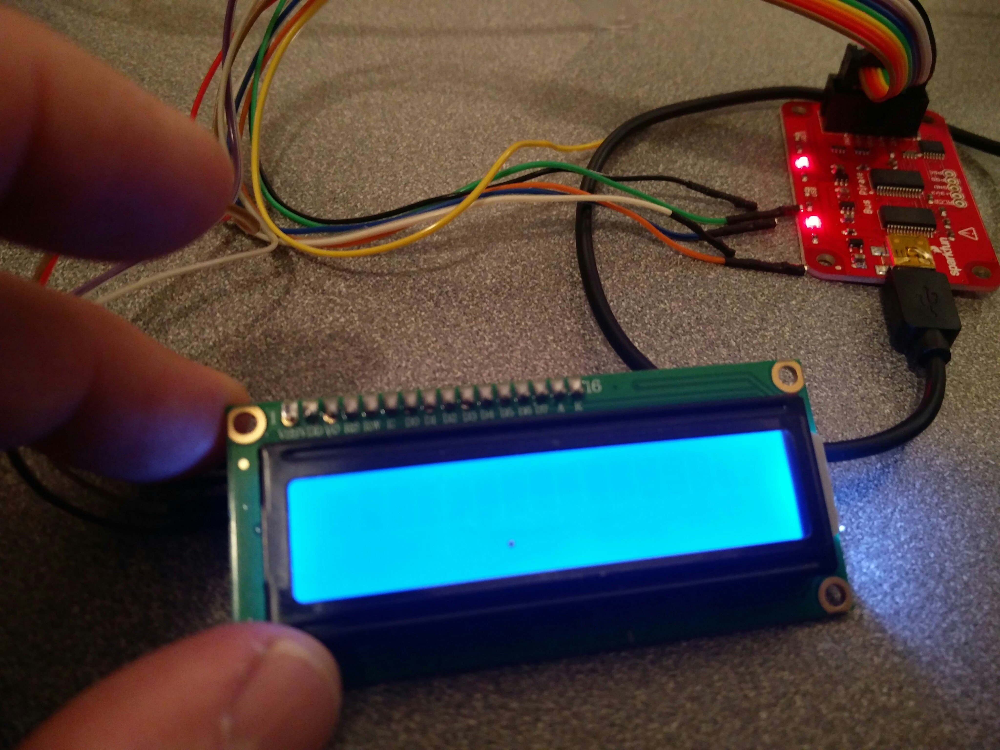
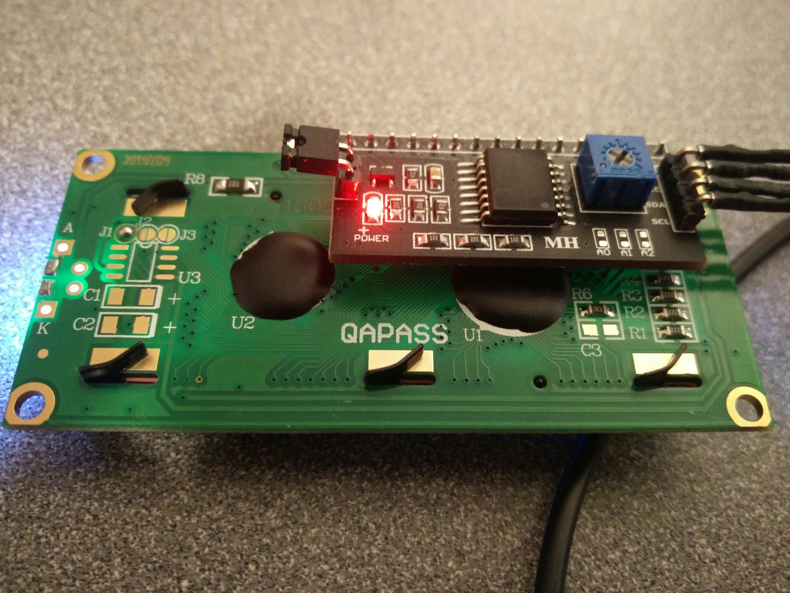
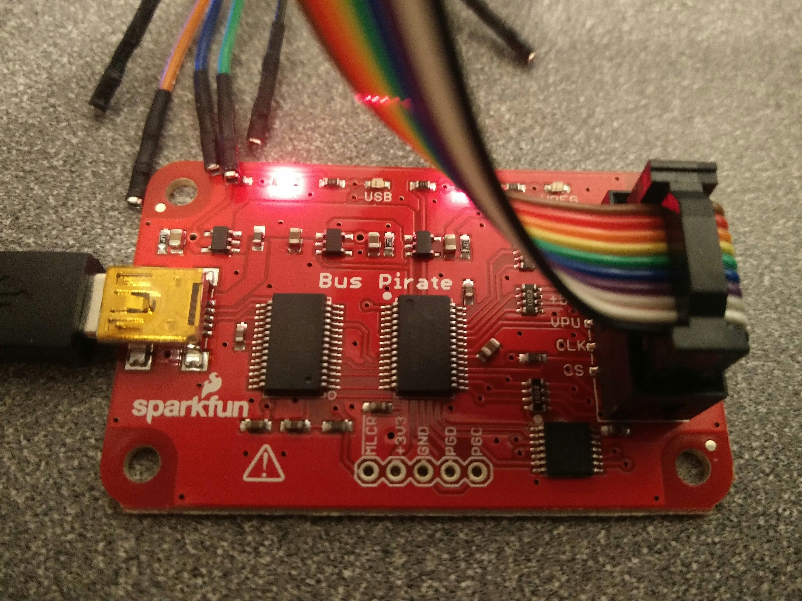
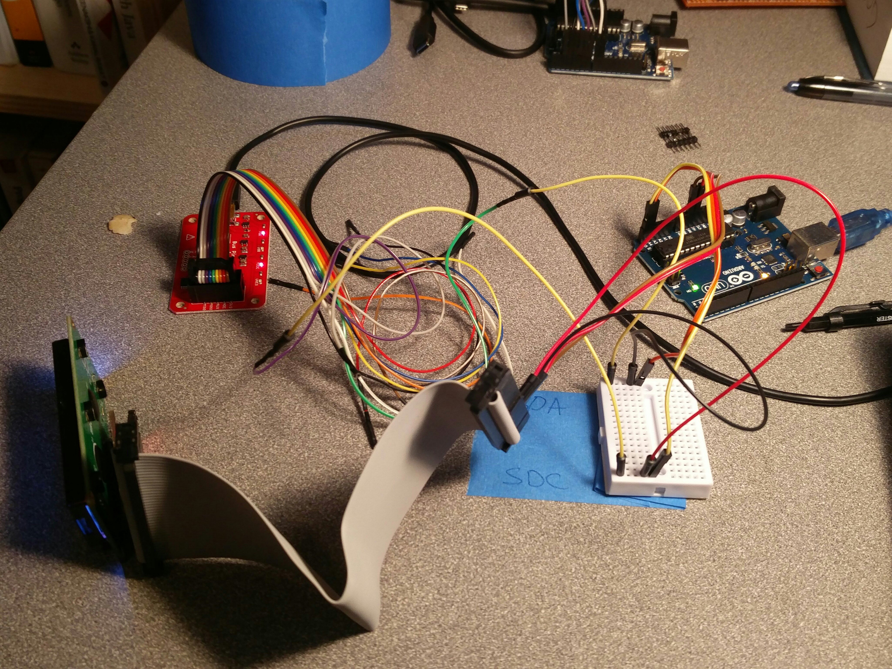
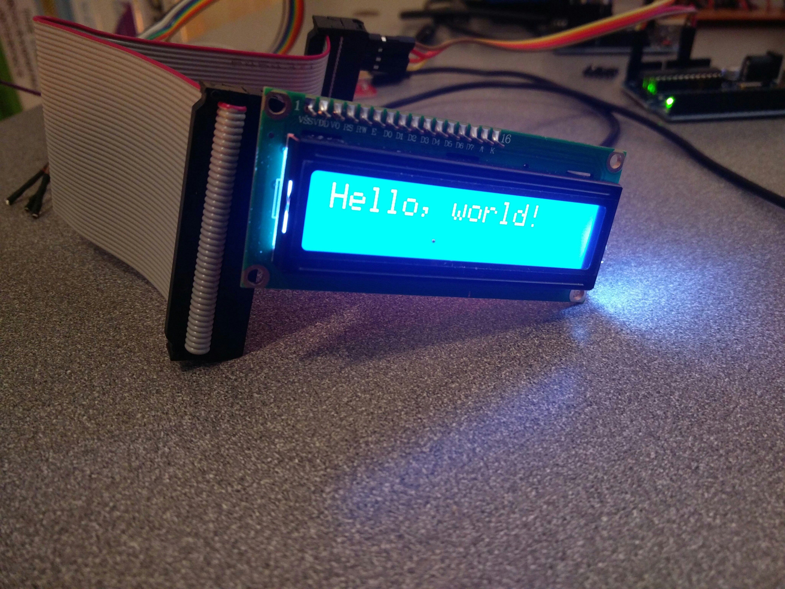
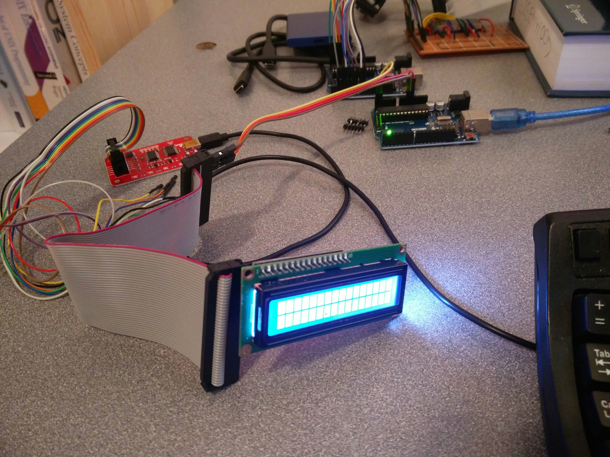
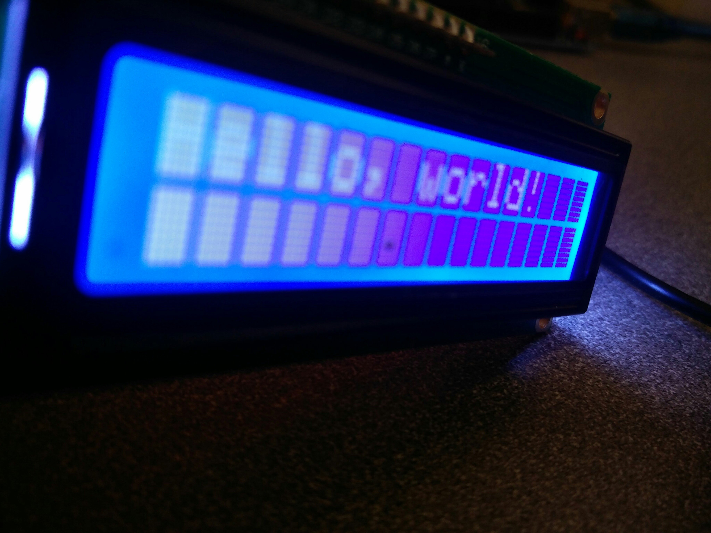

# 10 bus pirate

I'd like to make my own I2C backpack to control the LED array I created in 
the [previous post](../09-six-segment-led/readme.md). This means I need to learn
how to send commands over I2C and then I need to create a protocol to send
commands to the display. My thinking on this was simple: use the BP to write I2C
messages to an LCD display and thereby learn I2C. Simple, right?

Not really. The TLDR is I failed at this. I read the specs. I looked at source
code for LCD drivers. I sniffed the I2C messages from a working application.
There's something I don't understand going on here, and I've lost interest in
sorting it out.

This post documents how far I got.

## Bus Pirate (BP) -> I2C LCD

I'm using BP 3b device:

    I2C>i
    Bus Pirate v3b
    Firmware v5.10 (r559)  Bootloader v4.4
    DEVID:0x0447 REVID:0x3046 (24FJ64GA002 B8)
    http://dangerousprototypes.com
    CFG1:0xF9DF CFG2:0x3F7F
    *----------*
    Pinstates:
    1.(BR)  2.(RD)  3.(OR)  4.(YW)  5.(GN)  6.(BL)  7.(PU)  8.(GR)  9.(WT)  0.(Blk)
    GND     3.3V    5.0V    ADC     VPU     AUX     SCL     SDA     -       -
    P       P       P       I       I       I       I       I       I       I
    GND     3.29V   5.05V   0.00V   2.66V   L       H       H       H       H
    Power supplies ON, Pull-up resistors ON, Open drain outputs (H=Hi-Z, L=GND)
    MSB set: MOST sig bit first, Number of bits read/write: 8
    a/A/@ controls AUX pin
    I2C (mod spd)=( 0 3 )
    *----------*

The LCD is something from e.b.a.y. It says its' a "1602A" on the back and the
backpack has a PCF8574T chip. Summary:

* [1602A : 16 characters x 2 lines lcd display](./resources/LCD-1602A.pdf)
* [HD44780 compatible lcd controller?](./resources/HD44780.pdf)
* [PCF8574T I2C controller](./resources/PCF8574T-datasheet-8bit-io-expander-i2c.pdf)

Pics:

## BP Setup

Get help:

    ?
    General                                 Protocol interaction
    ---------------------------------------------------------------------------
    ?       This help                       (0)     List current macros
    =X/|X   Converts X/reverse X            (x)     Macro x
    ~       Selftest                        [       Start
    #       Reset                           ]       Stop
    $       Jump to bootloader              {       Start with read
    &/%     Delay 1 us/ms                   }       Stop
    a/A/@   AUXPIN (low/HI/READ)            "abc"   Send string
    b       Set baudrate                    123
    c/C     AUX assignment (aux/CS)         0x123
    d/D     Measure ADC (once/CONT.)        0b110   Send value
    f       Measure frequency               r       Read
    g/S     Generate PWM/Servo              /       CLK hi
    h       Commandhistory                  \       CLK lo
    i       Versioninfo/statusinfo          ^       CLK tick
    l/L     Bitorder (msb/LSB)              -       DAT hi
    m       Change mode                     _       DAT lo
    o       Set output type                 .       DAT read
    p/P     Pullup resistors (off/ON)       !       Bit read
    s       Script engine                   :       Repeat e.g. r:10
    v       Show volts/states               .       Bits to read/write e.g. 0x55.2
    w/W     PSU (off/ON)            <x>/<x= >/<0>   Usermacro x/assign x/list all

Get version:

    HiZ>i
    Bus Pirate v3b
    Firmware v5.10 (r559)  Bootloader v4.4
    DEVID:0x0447 REVID:0x3046 (24FJ64GA002 B8)
    http://dangerousprototypes.com

Get voltages:

    HiZ>v
    Pinstates:
    1.(BR)  2.(RD)  3.(OR)  4.(YW)  5.(GN)  6.(BL)  7.(PU)  8.(GR)  9.(WT)  0.(Blk)
    GND     3.3V    5.0V    ADC     VPU     AUX     CLK     MOSI    CS      MISO
    P       P       P       I       I       I       I       I       I       I
    GND     0.00V   0.00V   0.00V   0.00V   L       L       L       L       L
    HiZ>

(HiZ means high impedance mode, all pins tied to ground)

Configure i2c mode:

    HiZ>m
    1. HiZ
    2. 1-WIRE
    3. UART
    4. I2C
    5. SPI
    6. 2WIRE
    7. 3WIRE
    8. LCD
    9. DIO
    x. exit(without change)

    (1)>4
    Set speed:
     1. ~5KHz
     2. ~50KHz
     3. ~100KHz
     4. ~400KHz

    (1)>4
    Ready
    I2C>

I have the BP connected to the LCD display, so let's find the address:

First I have to fumble with things. I forgot to turn on the power (W)...

Find the macro to search the address space:

    I2C>(0)
     0.Macro menu
     1.7bit address search
     2.I2C sniffer

Run the (1) macro:

    I2C>(1)
    Searching I2C address space. Found devices at:
    Warning: *Short or no pull-up

Oops, I2C cannot signal if we don't hold the SDA line high, so set the pullups:

    I2C>P
    Pull-up resistors ON
    Warning: no voltage on Vpullup pin

Hmm, first time I've seen this error, let's check the voltages...

    I2C>v
    Pinstates:
    1.(BR)  2.(RD)  3.(OR)  4.(YW)  5.(GN)  6.(BL)  7.(PU)  8.(GR)  9.(WT)  0.(Blk)
    GND     3.3V    5.0V    ADC     VPU     AUX     SCL     SDA     -       -
    P       P       P       I       I       I       I       I       I       I
    GND     0.00V   0.00V   0.00V   0.00V   L       L       L       L       L

Oops. Forgot to turn on power. Pin 2/RD/Red goes to VCC on the device, and that should be at 3.3V.

    I2C>W
    Power supplies ON

Now we should see some voltages on VCC (Red wire (RD)):

    I2C>v
    Pinstates:
    1.(BR)  2.(RD)  3.(OR)  4.(YW)  5.(GN)  6.(BL)  7.(PU)  8.(GR)  9.(WT)  0.(Blk)
    GND     3.3V    5.0V    ADC     VPU     AUX     SCL     SDA     -       -
    P       P       P       I       I       I       I       I       I       I
    GND     3.27V   5.05V   0.00V   2.66V   L       H       H       H       H

Now let's search for the devices on this bus:

    I2C>(1)
    Searching I2C address space. Found devices at:
    0x4E(0x27 W) 0x4F(0x27 R)

Bingo. My old friend, '0x27'.

### First Example (FAIL)

I started working from this [example](https://embeddedcode.wordpress.com/2014/12/06/getting-started-with-an-i2c-lcd-using-a-bus-pirate/).

However, after changing the device address for his examples, I could not get the
sequences to display anything:

    [0x4e 0x00 0x38][0x4e 0x00 0x39][0x4e 0x00 0x50][0x4e 0x00 0x6c][0x4e 0x00 0x0c][0x4e 0x00 0x39][0x4e 0x00 0x14][0x4e 0x00 0x79][0x4e 0x00 0x0c][0x4e 0x00 0x01]

Here's what those control and data values correspond to in binary (as that's
what the data sheets use):

    0x38 = 56 = 0b00111000
    0x39 = 57 = 0b00111001
    0x50 = 80 = 0b01010000
    0x6C = 108 = 0b01101100
    0x0C = 12 = 0b00001100
    0x39 = 57 = 0b00111001
    0x14 = 20 = 0b00010100
    0x79 = 121 = 0b01111001
    0x0C = 12 = 0b00001100
    0x01 = 1 = 0b00000001

And according to the above tut, this should print out 'Hello':

    [0x4e 0x40 0x48 0x65 0x6c 0x6c 0x6f]

Again, that did not work as expected, and honestly, I don't see why it would.
Those do not seem to be the same control values that the
Hitachi_HD44780_LCD_controller uses. 

However, if I run the above command a time or two, eventually the screen starts
flashing with a white cursor.

Here are my notes from the [HD44780
datasheet](./resources/HD44780.pdf):

### 8 Bit Mode

#### Initializing by Instruction (page 45)

Initialize to 8 bit mode

    Power on...

    Initialize                  0 0 0 0 1 1 * * * *     [0x4e 0x00 0x30]%%%%%
    Initialize                  0 0 0 0 1 1 * * * *     [0x4e 0x00 0x30]%
    Initialize                  0 0 0 0 1 1 * * * *     [0x4e 0x00 0x30]%

Set num lines and font

    Fx Num lines and font       0 0 0 0 1 1 N F * *
    2 lines  (N=1)
    5x8 dots (F=0)              0 0 0 0 1 1 1 0 * *     [0x4e 0x00 0x0e]

Display OFF

    Fx display off              0 0 0 0 0 0 1 0 0 0     [0x4e 0x00 0x08]

Display Clear

    Fx display clear            0 0 0 0 0 0 0 0 0 1     [0x4e 0x00 0x01]

Entry Mode

    Fx entry mode               0 0 0 0 0 0 0 1 I/D S
    Increment (I=1)
    Display Shift (S=1)         0 0 0 0 0 0 0 1 1 1     [0x4e 0x00 0x07]

Attributes from page 25.

Full Initialization command:

    [0x4e 0x00 0x30]%%%%%[0x4e 0x00 0x30]%[0x4e 0x00 0x30]%[0x4e 0x00 0x0e]%[0x4e 0x00 0x08]%[0x4e 0x00 0x01]%[0x4e 0x00 0x07]

#### Writing data 8-Bit Operation, 8-Digit × 1-Line Display Example with Internal Reset (page 40)

    1) Reset
    2) Function Set             0000110000              [0x4e 0x00 0x30]
    3) Display on               0000001110              [0x4e 0x00 0x0e]
    4) Entry mode               0000000110              [0x4e 0x00 0x06]
    5) Write data               1001001000              [0x4e 0x02 0x48]

Full write command:

    [0x4e 0x00 0x30][0x4e 0x00 0x0e][0x4e 0x00 0x06][0x4e 0x02 0x48] 

-------------------------------------------------
I fundamentally do not understand something here.
-------------------------------------------------

The display backlight is on. If I look closely, I can see the upper row of 16
squares for the digits/characters as very light grey dots. But the display is
not showing anything. I've seen this display stuff before, and it's white on
blue, very striking and visible. This is not displaying characters yet.

### 4 Bit Mode

#### Initializing by Instruction (page 46)

Initialize to 4 bit mode

Power on...

                                RS R/W DB7 DB6 DB5 DB4
    Function Set                0 0 0 0 1 1                 [0x4e 0x03]%%%%
    Function Set                0 0 0 0 1 1                 [0x4e 0x03]%
    Function Set                0 0 0 0 1 1                 [0x4e 0x03]%
    Function Set                0 0 0 0 1 0                 [0x4e 0x02]
    Function Set                0 0 0 0 1 0                 [0x4e 0x02]     

Full command

    [0x4e 0x03]%%%%[0x4e 0x03]%[0x4e 0x03]%[0x4e 0x02][0x4e 0x02]    

Initialize to 4 bit mode, but use the masks that we see in the source code:

Power on...

                     RS R/W DB7 DB6 DB5 DB4 -> SHIFTED      |   MASKS        == 
    Function Set     0 0 0 0 1 1               0b00110000       0b00000100      0b00110100      [0x4e 0x34][0x4e 0x30]%%%%
    Function Set     0 0 0 0 1 1                                                                [0x4e 0x34][0x4e 0x30]%
    Function Set     0 0 0 0 1 1                                                                [0x4e 0x34][0x4e 0x30]% 
    Function Set     0 0 0 0 1 0               0b00100000                       0b00100100      [0x4e 0x24][0x4e 0x20]
    Function Set     0 0 0 0 1 0                                                                [0x4e 0x24][0x4e 0x20]

Full command

    [0x4e 0x34][0x4e 0x30]%%%%[0x4e 0x34][0x4e 0x30]%[0x4e 0x34][0x4e 0x30]%[0x4e 0x24][0x4e 0x20][0x4e 0x24][0x4e 0x20][0x4e 0x04]

#### Writing data 4-Bit Operation, 4-Digit × 1-Line Display Example with Internal Reset (page 40)

## Ask Experts

I asked an expert, and they suggested that it looks like the I2C chip does not
have enough pins to drive the LCD driver chip in full 8 bit mode.

    The PCF8574T is just an I/O expander and doesn't actually have enough i/o pins to run the LCD in 8-bit mode, so the one that I found use the low 3 bits to run the LCD's control signals (RS, R/W, E) and the high 4 bits for the corresponding 4 bits of the LCD's data bus. This arrangement means that every byte written to the LCD requires multiple I2C transactions.
    * reference schematic: https://bitbucket.org/celem/sainsmart-i2c-lcd/src/3adf8e0d2443/sainsmarti2clcd.pdf
    * reference code for driving the LCD in this configuration: https://github.com/fmilburn3/LCD_I2C/blob/master/LiquidCrystal_I2C.cpp
    Scroll down to line 228, "low level data pushing commands", for the gory details of the required i2c transactions.

## Reverse Engineer

Ok, so I can see all the bit shifting and masking that's going on in the code.
It should be simple from here, right? And I'm lazy, so why not just run some
working C code, verify it displays what I expect, and use the BP to sniff the
I2C bus?

Use this
[tut](https://osoyoo.com/2017/07/09/arduino-lesson-i2c-lcd1602-display/) to
write to the display:

1. Upload the `i2c-scanner` sketch and find that our device is at 0x27, same as the bus pirate told us before. Now we confirm that the `arduino` tool chain is working as expected.

2. Ran the demo app and printed 'Hello, world!' to the screen. At first I just
   had these white blocks, and I was like, Oh no. But then i remembered I had
   adjusted the pot on the back...turns out that was the culprit. Once adjusted
   properly, the white blocks (on pixels) faded back and the only the text was
   being displayed.

* 
* 
* 
* 

Now that I have a working example, I'll use the BP to sniff thi I2C messages
being sent to the device.

So, what this mess of wires shows is a simple tee off the SDA and SDC lines from
the arduino to the display.

Connect BP:

    screen /dev/ttyUSB 115200

    #

    Bus Pirate v3b
    Firmware v5.10 (r559)  Bootloader v4.4
    DEVID:0x0447 REVID:0x3046 (24FJ64GA002 B8)
    http://dangerousprototypes.com
    HiZ>m
    1. HiZ
    2. 1-WIRE
    3. UART
    4. I2C
    5. SPI
    6. 2WIRE
    7. 3WIRE
    8. LCD
    9. DIO
    x. exit(without change)

    (1)>4
    Set speed:
     1. ~5KHz
     2. ~50KHz
     3. ~100KHz
     4. ~400KHz

    (1)>4
    Ready
    I2C>

Make sure the pull up resistors are on:

    I2C>P
    Pull-up resistors ON

Start the sniffer:

    I2C>(2)
    Sniffer
    Any key to exit

Deploy the arduino code to the device and watch the sniffer:

    [0x4E+0x00+][0x4E+0x30+][0x4E+0x34+][0x4E+0x30+][0x4E+0x30+][0x4E+0x34+][0x4E+0x30+][0x4E+0x30+][0x4E+0x34+][0x4E+0x30+][0x4E+0x20+][0x4E+0x24+][0x4E+0x20+][0x4E+0x20+][0x4E+0x24+][0x4E+0x20+][0x4E+0x80+][0x4E+0x84+][0x4E+0x80+][0x4E+0x00+][0x4E+0x04+][0x4E+0x00+][0x4E+0xC0+][0x4E+0xC4+][0x4E+0xC0+][0x4E+0x00+][0x4E+0x04+][0x4E+0x00+][0x4E+0x10+][0x4E+0x14+][0x4E+0x10+][0x4E+0x00+][0x4E+0x04+][0x4E+0x00+][0x4E+0x60+][0x4E+0x64+][0x4E+0x60+][0x4E+0x00+][0x4E+0x04+][0x4E+0x00+][0x4E+0x40+][0x4E+0x24+][0x4E+0x20+][0x4E+0x08+][0x4E+0x49+][0x4E+0x4D+][0x4E+0x49+][0x4E+0x89+][0x4E+0x8D+][0x4E+0x89+][0x4E+0x69+][0x4E+0x6D+][0x4E+0x69+][0x4E+0x59+][0x4E+0x5D+][0x4E+0x59+][0x4E+0x69+][0x4E+0x6D+][0x4E+0x69+][0x4E+0xC9+][0x4E+0xCD+][0x4E+0xC9+][0x4E+0x69+][0x4E+0x6D+][0x4E+0x69+][0x4E+0xC9+][0x4E+0xCD+][0x4E+0xC9+][0x4E+0x69+][0x4E+0x6D+][0x4E+0x69+][0x4E+0xF9+][0x4E+0xFD+][0x4E+0xF9+][0x4E+0x29+][0x4E+0x2D+][0x4E+0x29+][0x4E+0xC9+][0x4E+0xCD+][0x4E+0xC9+][0x4E+0x29+][0x4E+0x2D+][0x4E+0x29+][0x4E+0x09+][0x4E+0x0D+][0x4E+0x09+][0x4E+0x79+][0x4E+0x7D+][0x4E+0x79+][0x4E+0x79+][0x4E+0x7D+][0x4E+0x79+][0x4E+0x69+][0x4E+0x6D+][0x4E+0x69+][0x4E+0xF9+][0x4E+0xFD+][0x4E+]][0x4E+0x79+][0x4E+0x7D+][0x4E+0x79+][0x4E+0x29+][0x4E+0x2D+][0x4E+0x29+][0x4E+0x69+][0x4E+0x6D+][0x4E+0x69+][0x4E+0xC9+][0x4E+0xCD+][0x4E+0xC9+][0x4E+0x69+][0x4E+0x6D+][0x4E+0x69+][0x4E+0x49+][0x4E+0x4D+][0x4E+0x49+][0x4E+0x29+][0x4E+0x2D+][0x4E+0x29+][0x4E+0x19+][0x4E+0x1D+][0x4E+0x19+]

Now round trip this data and see if the BP can drive the display directly with
this data. So I remove the SDA and SDC pins from the arduino and leave the setup
as is and switch the BP into regular I2C mode:

No go. The bits are getting copied to the device, but the screen remains blank.
I wonder if this is b/c the delays are not encoded in this data stream?

    [0x4E+0x00+]

    [0x4E+0x30+]%%%%%%%%0x4E+0x34+]%%%%%%%%%[0x4E+0x30+]%%%%[0x4E+0x30+]%%%%
    [0x4E+0x34+][0x4E+0x30+]%%%%[0x4E+0x30+]%%%%[0x4E+0x34+][0x4E+0x30+]%%%%

    [0x4E+0x20+][0x4E+0x24+][0x4E+0x20+][0x4E+0x20+][0x4E+0x24+][0x4E+0x20+][0x4E+0x80+]
    [0x4E+0x84+][0x4E+0x80+][0x4E+0x00+][0x4E+0x04+][0x4E+0x00+][0x4E+0xC0+][0x4E+0xC4+]
    [0x4E+0xC0+][0x4E+0x00+][0x4E+0x04+][0x4E+0x00+][0x4E+0x10+][0x4E+0x14+][0x4E+0x10+]
    [0x4E+0x00+][0x4E+0x04+][0x4E+0x00+][0x4E+0x60+][0x4E+0x64+][0x4E+0x60+][0x4E+0x00+]
    [0x4E+0x04+][0x4E+0x00+][0x4E+0x40+][0x4E+0x24+][0x4E+0x20+][0x4E+0x08+][0x4E+0x49+]
    [0x4E+0x4D+][0x4E+0x49+][0x4E+0x89+][0x4E+0x8D+][0x4E+0x89+][0x4E+0x69+][0x4E+0x6D+]
    [0x4E+0x69+][0x4E+0x59+][0x4E+0x5D+][0x4E+0x59+][0x4E+0x69+][0x4E+0x6D+][0x4E+0x69+]
    [0x4E+0xC9+][0x4E+0xCD+][0x4E+0xC9+][0x4E+0x69+][0x4E+0x6D+][0x4E+0x69+][0x4E+0xC9+]
    [0x4E+0xCD+][0x4E+0xC9+][0x4E+0x69+][0x4E+0x6D+][0x4E+0x69+][0x4E+0xF9+][0x4E+0xFD+]
    [0x4E+0xF9+][0x4E+0x29+][0x4E+0x2D+][0x4E+0x29+][0x4E+0xC9+][0x4E+0xCD+][0x4E+0xC9+]
    [0x4E+0x29+][0x4E+0x2D+][0x4E+0x29+][0x4E+0x09+][0x4E+0x0D+][0x4E+0x09+][0x4E+0x79+]
    [0x4E+0x7D+][0x4E+0x79+][0x4E+0x79+][0x4E+0x7D+][0x4E+0x79+][0x4E+0x69+][0x4E+0x6D+]
    [0x4E+0x69+][0x4E+0xF9+][0x4E+0xFD+][0x4E+]]
    [0x4E+0x79+][0x4E+0x7D+][0x4E+0x79+][0x4E+0x29+][0x4E+0x2D+][0x4E+0x29+][0x4E+0x69+]
    [0x4E+0x6D+][0x4E+0x69+][0x4E+0xC9+][0x4E+0xCD+][0x4E+0xC9+][0x4E+0x69+][0x4E+0x6D+]
    [0x4E+0x69+][0x4E+0x49+][0x4E+0x4D+][0x4E+0x49+][0x4E+0x29+][0x4E+0x2D+][0x4E+0x29+]
    [0x4E+0x19+][0x4E+0x1D+][0x4E+0x19+]

Still working on round tripping the data...something is wonky here. I _was_ able
to get the screen to turn on, but simply copying and pasting this into BP is not
working for some reason.

----

Well, I learned a lot about I2C, BP, and LCD displays. While I have not figure
out exactly what is going on with this device, I know enough to tackle my next
project: build my own I2C display from discrete components.

----

## Links
* https://bitbucket.org/celem/sainsmart-i2c-lcd/src/3adf8e0d2443/sainsmarti2clcd.pdf
* http://www.eigenstudium.de/fileadmin/user_upload/Download/Datenblaetter/LCD-1602A.pdf
* [Danish Guy](https://www.youtube.com/watch?v=ey8flzU9DJg)
* [EEVBlog](https://www.youtube.com/watch?v=N60WSQc-G_8)
* http://dangerousprototypes.com/blog/bus-pirate-manual/i2c-guide/
* http://dangerousprototypes.com/docs/Bus_Pirate_101_tutorial
* https://crates.io/crates/embedded-hal
* https://crates.io/crates/linux-embedded-hal
* https://docs.rs/i2c/0.1.0/i2c/
* https://embeddedcode.wordpress.com/2014/12/06/getting-started-with-an-i2c-lcd-using-a-bus-pirate/
* https://en.wikipedia.org/wiki/Hitachi_HD44780_LCD_controller
* https://github.com/BusPirate/Bus_Pirate/blob/master/Firmware/hd44780.c
* https://github.com/dhylands/python_lcd/blob/master/lcd/i2c_lcd.py
* https://github.com/fdebrabander/Arduino-LiquidCrystal-I2C-library/blob/master/LiquidCrystal_I2C.h
* https://github.com/rust-embedded/rust-i2cdev
* https://jumptuck.wordpress.com/2010/01/20/using-the-bus-pirate-with-ubuntu/
* https://pdf1.alldatasheet.com/datasheet-pdf/view/18215/PHILIPS/PCF8574T.html
* https://www.amazon.com/SunFounder-Serial-Module-Arduino-Mega2560/dp/B019K5X53O/ref=as_li_ss_tl?keywords=20x4%2Bi2c%2Blcd&qid=1578774015&sr=8-3&th=1&linkCode=sl1&tag=makerguides-20&linkId=e5d7fe39960ed2425e5b9098b4b98a81&language=en_US
* https://www.instructables.com/Direct-Reading-of-LCD-Using-General-Purpose-IO/
* https://www.kernel.org/doc/Documentation/i2c/dev-interface
* https://www.linkinstruments.com/mso19.html
* https://www.sparkfun.com/datasheets/LCD/HD44780.pdf
* http://ww1.microchip.com/downloads/en/Appnotes/doc8103.pdf
* http://www.smbus.org/specs/
* [Ian at DP : Favorite Bus Pirate features](https://www.youtube.com/watch?v=NdXE4hm_lHY) 
* [Ian at DP : Serial port interfacing the Bus Pirate, Infrared Toy, and Logic Sniffer](https://www.youtube.com/watch?v=6grUGkShWJE)

## End

* [Prev](../09-six-segment-led/readme.md)
* [Next]()
