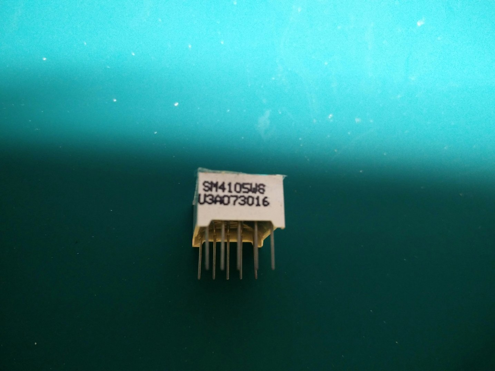
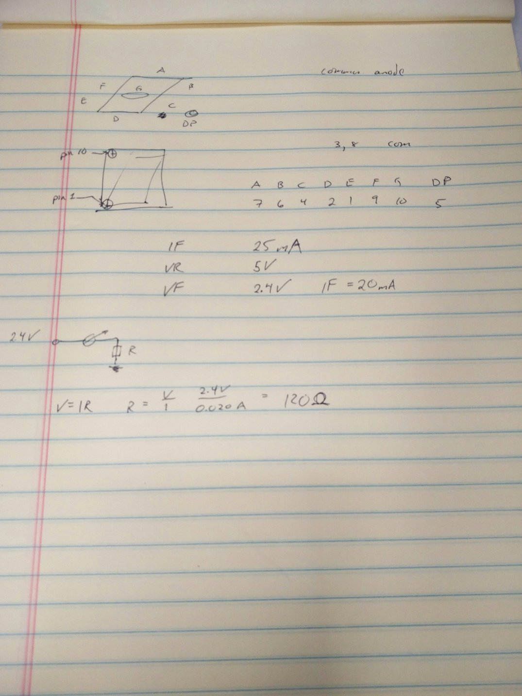
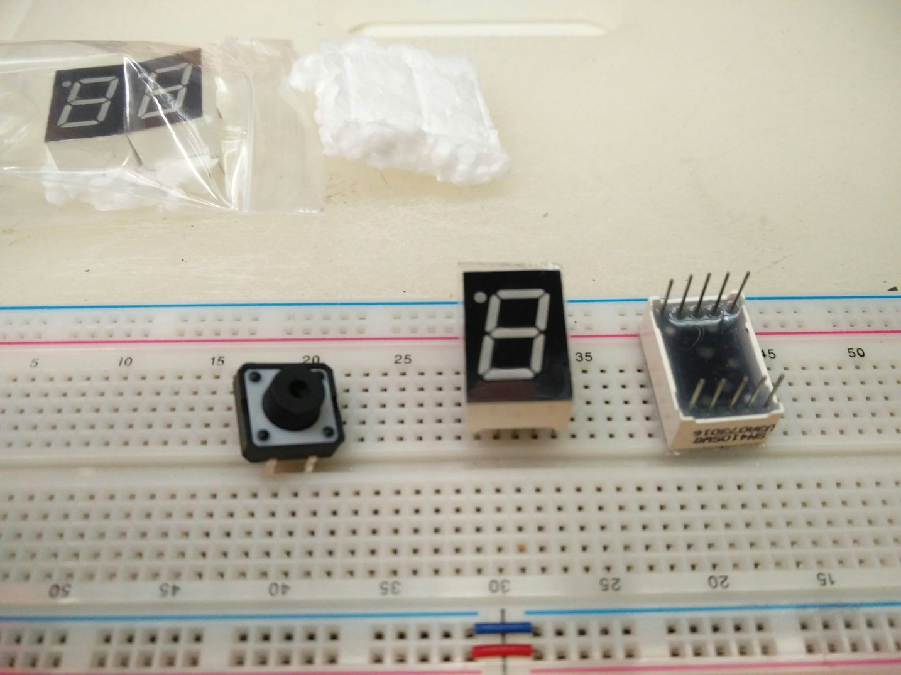
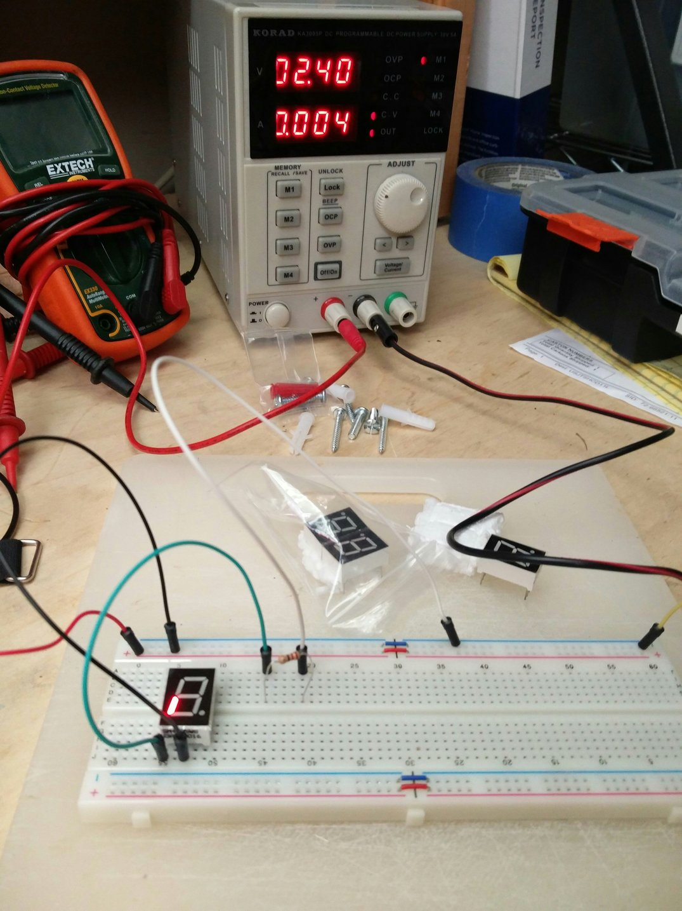

# 01 Multisegment LED

## Goal

Light up one of the LED segments.

## Components

### LED

I don't have my printer hooked up, but here's what I think are the specs for this LED:

I've also downloaded the spec here:

And since I haven't hooked up my printer yet, here are my notes from the spec:

### Build

Starting with the ususal suspects...

From the spec, we have:

    FV = 2.5V
    IF = 25mA

So a bit of math gives:

    V = IR
    R = V/I = 2.4V/0.020A = 120 Ohms

So I whacked in a 220Ohm resistor, set my PS to 2.4V and limited the current to 25mA and we have light!

## End

* 
* 
