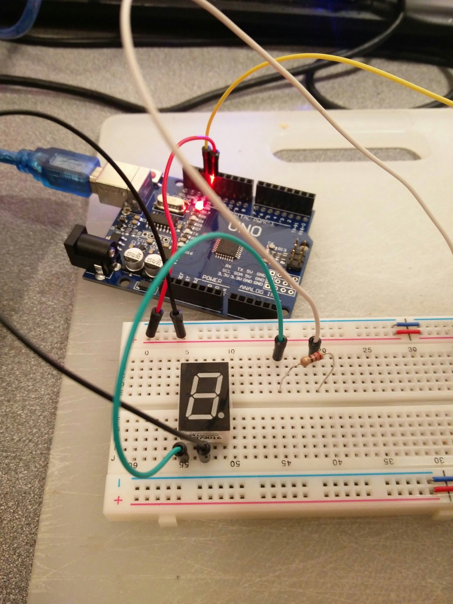

# 02 Multisegment LED Display controlled via Arduino Uno

## Dependencies

### Install Arduino IDE

arduino and avrdude (ubuntu)

    sudo apt install --reinstall arduino

Make sure avrdude is installed...

    $ which avrdude
    /usr/bin/avrdude

Permissions...for me the UNO came up as /dev/ttyUSB0.

    ls -lsa /dev/ttyUSB0 
    0 crwxrwxrwx 1 root dialout 188, 0 Sep  5 22:33 /dev/ttyUSB0

Arduino instructions say to add yourself to 'dialout' and 'tty'...

    sudo usermod -a -G dialout [my_username]
    sudo usermod -a -G tty [my_username]

This didn't help the errors uploading, so I wound up loosening the access perms on the usb device:

    sudo chmod 777 /dev/ttyUSB0

### Docs

* 

## Build

Upload sketch to blink an LED (CTRL-U):

https://www.electronicwings.com/arduino/digital-gpio-of-arduino

    void setup()
    {
      pinMode(13, OUTPUT);          // sets the digital pin 13 as output
    }

    void loop()
    {
      digitalWrite(13, HIGH);       // sets the digital pin 13 on
      delay(1000);                  // waits for a second
      digitalWrite(13, LOW);        // sets the digital pin 13 off
      delay(1000);                  // waits for a second
    }

## Success

Trust me, the lower left segment is blinking. This hookup is using GND and pin 13 on the board.

## End

* 
* 
