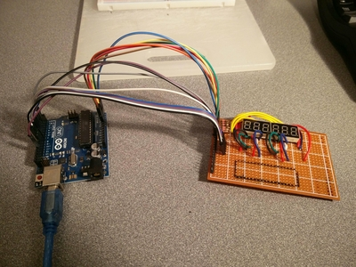
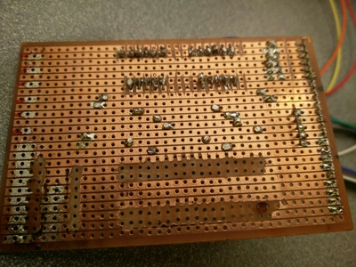
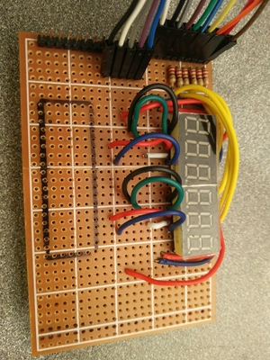
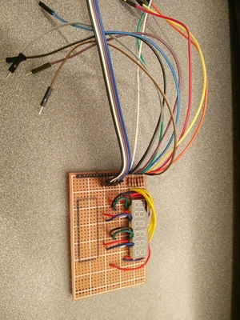

# 09 Six Segment LED

Extended the code from
[07-multisegment-led-rust-arduino](../07-multisegment-led-rust-arduino/readme.md)
to create a 6 segment led display running a count up ticker thingy. I used some
of the code from [08-rust-timers](../08-rust-timers/readme.md) and, since I'm
not using interrupts, it took about 10 minutes to code this up.

## Code

[code](./code/multisegment-led/avr/mseg-bin/src/main.rs)

## Build Pics

## Running

## End

* [Prev](../08-rust-timers/readme.md)
* [Next]()
