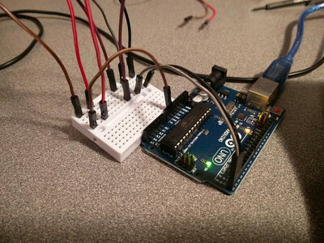
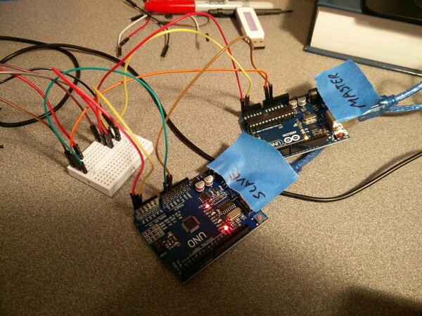

# 11 Custom I2C LCD Driver

In [09-six-segment-led](../09-six-segment-led/readme.md) I created a custom 6
segment LED. This LED is connected to an Arduino UNO with the LED COM pins
(common anode) connected to the A0-A5 Arduino GPIO pins and the Control Line
(segments) connected to D3-D9 Arduino GPIO pins. Using this as the base
hardware, this post will show how to write a simple I2C driver for this LED
array.

## Hardware
    
    CLIENT --> I2C BUS --> HARDWARE
    -----------------------------------------------
    BusPirate -> I2C -> Arduino Uno -> GPIO -> LEDs

## Background

### Serial Communication

First, I want to understand how the
[Serial.begin()](https://www.arduino.cc/reference/en/language/functions/communication/serial/begin/)
command works in the standard Arduino library. I'm a bit confused by serial
communications. Clearly the Arduino Uno is sending serial data to the USB port,
as I can see it when I run sample code that writes to serial like this:

#### Arduino C Code

`serial_out.ino`

    #include <Wire.h>
    void setup()
    {
      Wire.begin();
      Serial.begin(9600, SERIAL_8N1);
      Serial.println("\nTEST SERIAL OUT\n");
    }

    void loop()
    {
       Serial.println("TEST: 123456789 ABCDEFG abcdefg");
       delay(1000);
    }

#### Arduino IDE console output:

    TEST SERIAL OUT
    TEST: 123456789 ABCDEFG abcdefg
    TEST: 123456789 ABCDEFG abcdefg
    ...

#### BusPirate Session

##### Wiring

For UART we need to connect:

BUS PIRATE  | Arduino UNO
-----------|-------------
BLACK (RX)  | D1 (TX)
GREY (TX)   | D0 (RX)
BROWN (GND) | GND

##### Start bus pirate

    Bus Pirate v3b
    Firmware v5.10 (r559)  Bootloader v4.4
    DEVID:0x0447 REVID:0x3046 (24FJ64GA002 B8)
    http://dangerousprototypes.com
    HiZ>m
    1. HiZ
    2. 1-WIRE
    3. UART
    4. I2C
    5. SPI
    6. 2WIRE
    7. 3WIRE
    8. LCD
    9. DIO
    x. exit(without change)

##### Configure for UART (Serial)

    (1)>3
    Set serial port speed: (bps)
     1. 300
     2. 1200
     3. 2400
     4. 4800
     5. 9600
     6. 19200
     7. 38400
     8. 57600
     9. 115200
    10. BRG raw value

    (1)>5
    Data bits and parity:
     1. 8, NONE *default
     2. 8, EVEN
     3. 8, ODD
     4. 9, NONE
    (1)>
    Stop bits:
     1. 1 *default
     2. 2
    (1)>
    Receive polarity:
     1. Idle 1 *default
     2. Idle 0
    (1)>
    Select output type:
     1. Open drain (H=Hi-Z, L=GND)
     2. Normal (H=3.3V, L=GND)

    (1)>
    Ready

This should match what was configured by the sketch above in:

      Serial.begin(9600, SERIAL_8N1);

However, as we'll see, the output is still a bit garbled...

##### Sniff UART via BP 

    UART>(2)
    Raw UART input
    Any key to exit
    �T�BCDE

     AB5
        9 A�5
             ��
               ��5
    6789defgM�    789 efg
              ,V��S���,V�����bcde3456
    ABC                              ���2345�abc����ab����a��CDE
        AB5
           9 A�5
                89 ��5
    UART>

So something is clearly not quite right. I tried this at 300 and 1200 baud and
neither worked quite right with BP, either. Doh! I figured this out. I was leaving
my GND floating. I had assumed that since they are both grounded through the USB of my
laptop that they would be the same and would not need to be connected... apparently this leaves
them floating enough to garble the UART. Lesson learned. Thanks to these two websites for pointing me at this:

* http://gammon.com.au
* http://www.thebox.myzen.co.uk

Once fixed, the output looks as expected:

    (1)>
    Ready
    UART>(2)
    Raw UART input
    Any key to exit
    TEST: 123456789 ABCDEFG abcdefg
    TEST: 123456789 ABCDEFG abcdefg
    TEST: 123456789 ABCDEFG abcdefg
    TEST: 123456789 ABCDEFG abcdefg
    TEST: 123456789 ABCDEFG abcdefg

##### Echo /dev/ttyASM0 {baud rate}

    screen /dev/ttyASM0 9600

This produces the expected output, the same as the arduino ide console produces.

Note: you cannot have two devices attached to the same tty at the same time,
from what I can tell. So close the Arduino IDE console prior to launching
screen.

#### Arduino Rust Code

And in rust, you can see that we are passing in GPIO pins `d0` and `d1`. So is
this also writing data to both the USB port and to the pins?

https://github.com/Rahix/avr-hal/blob/master/boards/arduino-uno/examples/uno-serial.rs#L18

Only one way to find out, let's watch both the USB port and the GPIO pins and
see what's up...

##### Build avr-hal

Get avr-hal

    git clone https://github.com/Rahix/avr-hal
    cd av-hal

Build avr-hal

    cargo +nightly build

Compiles...

    Compiling proc-macro2 v1.0.24
    Compiling unicode-xid v0.2.1
    Compiling syn v1.0.44
    Compiling semver-parser v0.7.0
    Compiling nb v1.0.0
    Compiling proc-macro-hack v0.5.18
    Compiling ufmt-write v0.1.0 (https://github.com/Rahix/ufmt.git?rev=12225dc1678e42fecb0e8635bf80f501e24817d9#12225dc1)
    Compiling vcell v0.1.2
    Compiling void v1.0.2
    Compiling cfg-if v0.1.10
    Compiling paste v1.0.1
    Compiling nb v0.1.3
    Compiling embedded-hal v0.2.4
    Compiling semver v0.9.0
    Compiling rustc_version v0.2.3
    Compiling bare-metal v0.2.5
    Compiling quote v1.0.7
    Compiling ufmt-macros v0.1.1 (https://github.com/Rahix/ufmt.git?rev=12225dc1678e42fecb0e8635bf80f501e24817d9#12225dc1)
    Compiling avr-device-macros v0.2.2
    Compiling avr-device v0.2.2
    Compiling ufmt v0.1.0 (https://github.com/Rahix/ufmt.git?rev=12225dc1678e42fecb0e8635bf80f501e24817d9#12225dc1)
    Compiling avr-hal-generic v0.1.0 (/home/todd/repos/external/avr-hal/avr-hal-generic)
    Compiling atmega32u4-hal v0.1.0 (/home/todd/repos/external/avr-hal/chips/atmega32u4-hal)
    Compiling atmega168-hal v0.1.0 (/home/todd/repos/external/avr-hal/chips/atmega168-hal)
    Compiling atmega2560-hal v0.1.0 (/home/todd/repos/external/avr-hal/chips/atmega2560-hal)
    Compiling atmega328p-hal v0.1.0 (/home/todd/repos/external/avr-hal/chips/atmega328p-hal)
    Compiling atmega1280-hal v0.1.0 (/home/todd/repos/external/avr-hal/chips/atmega1280-hal)
    Compiling attiny85-hal v0.1.0 (/home/todd/repos/external/avr-hal/chips/attiny85-hal)
    Compiling attiny88-hal v0.1.0 (/home/todd/repos/external/avr-hal/chips/attiny88-hal)
    Compiling atmega48p-hal v0.1.0 (/home/todd/repos/external/avr-hal/chips/atmega48p-hal)
    Compiling trinket v0.1.0 (/home/todd/repos/external/avr-hal/boards/trinket)
    Compiling arduino-diecimila v0.1.0 (/home/todd/repos/external/avr-hal/boards/arduino-diecimila)
    Compiling arduino-uno v0.1.0 (/home/todd/repos/external/avr-hal/boards/arduino-uno)
    Compiling sparkfun-pro-micro v0.1.0 (/home/todd/repos/external/avr-hal/boards/sparkfun-pro-micro)
    Compiling arduino-leonardo v0.1.0 (/home/todd/repos/external/avr-hal/boards/arduino-leonardo)
    Compiling bigavr6 v0.1.0 (/home/todd/repos/external/avr-hal/boards/bigavr6)
    Compiling arduino-mega2560 v0.1.0 (/home/todd/repos/external/avr-hal/boards/arduino-mega2560)
    Finished dev [optimized + debuginfo] target(s) in 1m 06s

##### Run a quick sample

Let's ensure that the toolchain is fully functional by running the `blink`
example:

Build blink

    cd boards/arduino-uno
    cargo +nightly build --example uno-blink

Run blink

    cargo +nightly run --example uno-blink

Yes, the on-board led is blinking. Good.

##### Run Serial

Modify [uno-serial.rs](https://github.com/Rahix/avr-hal/blob/master/boards/arduino-uno/examples/uno-serial.rs) to just print out stuff in the inner loop like this:

#[arduino_uno::entry]
fn main() -> ! {
    let dp = arduino_uno::Peripherals::take().unwrap();

    let mut pins = arduino_uno::Pins::new(dp.PORTB, dp.PORTC, dp.PORTD);

    let mut serial = arduino_uno::Serial::new(
        dp.USART0,
        pins.d0,
        pins.d1.into_output(&mut pins.ddr),
        9600,
    );

    loop {
            ufmt::uwriteln!(&mut serial, "TEST: 123456789 ABCDEFG abcdefg\r").void_unwrap();
            arduino_uno::delay_ms(1000);
    }
}

Now build and run...

    cargo +nightly build --example uno-serial
    cargo +nightly run --example uno-serial

Connect to the USB Serial stream from computer

    screen /dev/ttyACM0 9600

Connect to the GPIO Serial stream from BP

    Bus Pirate v3b
    Firmware v5.10 (r559)  Bootloader v4.4
    DEVID:0x0447 REVID:0x3046 (24FJ64GA002 B8)
    http://dangerousprototypes.com
    HiZ>m
    1. HiZ
    2. 1-WIRE
    3. UART
    4. I2C
    5. SPI
    6. 2WIRE
    7. 3WIRE
    8. LCD
    9. DIO
    x. exit(without change)

    (1)>3
    Set serial port speed: (bps)
     1. 300
     2. 1200
     3. 2400
     4. 4800
     5. 9600
     6. 19200
     7. 38400
     8. 57600
     9. 115200
    10. BRG raw value

    (1)>5
    Data bits and parity:
     1. 8, NONE *default
     2. 8, EVEN
     3. 8, ODD
     4. 9, NONE
    (1)>
    Stop bits:
     1. 1 *default
     2. 2
    (1)>
    Receive polarity:
     1. Idle 1 *default
     2. Idle 0
    (1)>
    Select output type:
     1. Open drain (H=Hi-Z, L=GND)
     2. Normal (H=3.3V, L=GND)

    (1)>
    Ready
    UART>

Ok, so let's see what's passing over the UART:

    UART>(2)
    Raw UART input
    Any key to exit
    TEST: 123456789 ABCDEFG abcdefg
    TEST: 123456789 ABCDEFG abcdefg
    TEST: 123456789 ABCDEFG abcdefg
    TEST: 123456789 ABCDEFG abcdefg
    TEST: 123456789 ABCDEFG abcdefg
    TEST: 123456789 ABCDEFG abcdefg

Good, got it.

### Verify I2C

This is a great I2C sample to start from: http://gammon.com.au/i2c.

Load an UNO with the [master.ino](./sketches/master/master.ino) and another
UNO with [slave.ino](./sketches/slave/slave.ino):

#### Wiring

Here you can see that I've tied and Tee'd the A4 (SDA) and A5 (SCL) pins of the
two arduinos and the BP via the mini breadboard:

Now, with the master sending messages (counting from 2 to 7) to the slave:

    (1)>4
    Set speed:
     1. ~5KHz
     2. ~50KHz
     3. ~100KHz
     4. ~400KHz

    (1)>4
    Ready
    I2C>(0)
     0.Macro menu
     1.7bit address search
     2.I2C sniffer
    I2C>2
    WRITE: 0x02 NACK 
    I2C>(2)
    Sniffer
    Any key to exit
    [0x54+0x02+][0x54+0x03+][0x54+0x04+][0x54+0x05+][0x54+0x06+][0x54+0x07+]

So this looks as expected.

## Simple I2C Protocol

Simple Protocol

COMMAND NAME | DESCRIPTION | I2C 
-------------|-------------|-----
repeat | write SEGMENTS to all the digit indexes (the entire display) | [ADDRESS 0b00000001 SEGMENTS]
write | write SEGMENTS at index (XXXX) | [ADDRESS 0bXXXX0010 SEGMENTS]
lumen | set brightness at index | [ADDRESS 0bXXXX0011 LUMENS]
blink | blink at index | [ADDRESS 0bXXXX0100 SEGMENTS]

VALUES / PARAMS | DESCRIPTION
----------------|------------
ADDRESS | I2C device address configured in software
SEGMENTS | led segments A-DP, with A being the MSB and DP the LSB
XXXX | index of LED to write to, from left to right
LUMENS | brightness value (0 off, 255 fully on)

### Building the I2C Protocol App

#### Create `i2c-led-driver` app

Create app directory

    mkdir rust
    cd rust

Create base app using template

    cookiecutter gh:toddg/arduino-rust-seed

Enter requested data:

    full_name [your_full_name]: Todd Greenwood
    email [your_email_address]: pub+github@zwrob.com
    project_name [project-name]: i2c-led-driver
    repo_name [repo_name]: github.com/toddg/learn-electronics
    project_short_description [project_short_description]: I2C LED Array driver (custom)
    release_date [release_date]: 10/13/2020
    year [release_year]: 2020
    version [0.0.1]: 

Verify template builds

    cd i2c-led-driver
    make build

Success!

#### Add code for serial 

Print debug messages...

#### Add code for I2C Bus

#### Add code to listen to Bus messages

#### Add code to write to LEDs

## Links

* http://gammon.com.au/interrupts
* https://www.nongnu.org/avr-libc/user-manual/group__avr__interrupts.html
* https://arduino.stackexchange.com/questions/19756/how-does-serial-communications-work-on-the-arduino
* https://circuitdigest.com/microcontroller-projects/arduino-i2c-tutorial-communication-between-two-arduino
* https://en.wikipedia.org/wiki/Universal_asynchronous_receiver-transmitter
* https://rahix.github.io/avr-hal/atmega328p_hal/i2c/index.html
* https://rahix.github.io/avr-hal/atmega328p_hal/i2c/struct.I2c.html
* https://www.arduino.cc/reference/en/language/functions/communication/serial/begin/
* https://www.norwegiancreations.com/2017/12/arduino-tutorial-serial-inputs/
